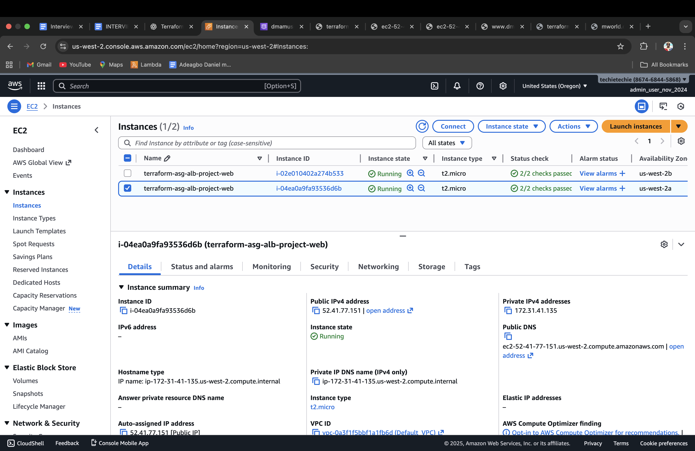
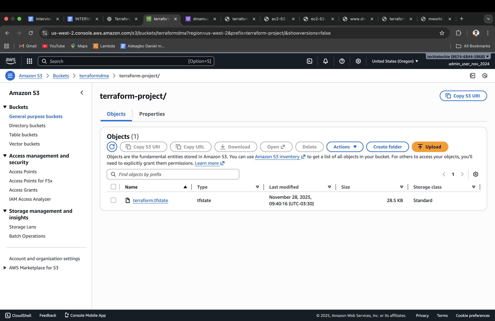
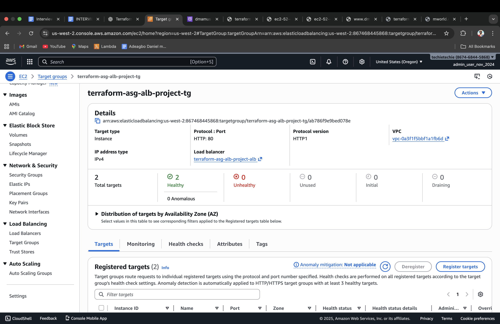
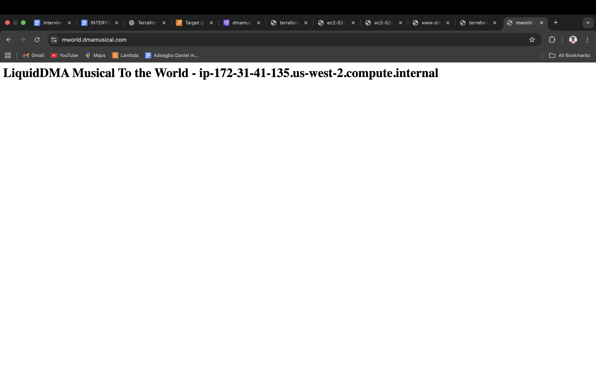
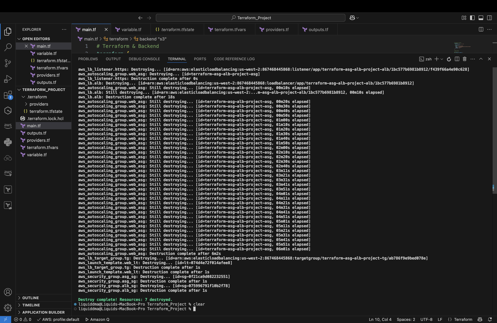

# Terraform Project – HTTPS ALB + Auto Scaling Group + Launch Template (Amazon Linux 2023)
 
# This project deploys a secure, scalable, highly available web application on AWS using Terraform.
It provisions an Application Load Balancer (HTTPS only), an Auto Scaling Group of Amazon Linux 2023 EC2 instances, a Launch Template with Apache installed, and stores Terraform state remotely in an S3 backend.

# **FEATURES:**

1. # HTTPS-Only Application Load Balancer (ALB)
   Listens strictly on port 443

   Uses an ACM certificate for SSL/TLS

   Forwards traffic internally to EC2 web servers

2. # Auto Scaling Group (ASG)
   Minimum: 2 instances

   Desired: 2 instances

   Maximum: 4 instances

   Integrated health checks

   Connected to a Target Group behind the ALB

3. # Launch Template
   Amazon Linux 2023 AMI

   Installs Apache Web Server (httpd)

   Displays a custom message containing hostname

4. # Security Architecture
   ALB SG: Allows 443 from the Internet

   EC2 SG: Allows 80 ONLY from the ALB

   EC2 instances are not publicly accessible

5. # S3 Backend
   Remote state store

---

# **Prerequisites**

1. AWS CLI configured

2. Terraform installed

# **File Needed**

main.tf              #Provider + includes files automatically

variables.tf         #Variables for region, instance type, tags

Providers.tf         #Contains the AWS provider configuration

terraform.tfvars     #Holds actual values for the variables

outputs.tf           #Shows VPC ID and EC2 public IP

--- 

# Step-by-Step Setup

     terraform init                  #Initialize Terraform (downloads providers)
     terraform validate              #Run checks to verify all is working well
     terraform plan                  #See what will be created
     terraform apply                 #Apply the changes (type 'yes' when prompted)
     terraform destroy               #To delete everything after use (type 'yes' when prompted)
     

[]

Running EC2 in console
[]

s3 backend
Running EC2 with Default VPC
[]

Load Balancer listening strictly to port 443
[]

Webpage1
[]

Webpage2
[]

Destroy/Delete everything after use
[]

# **Summary**
This project is organized into modular Terraform files that work together to deploy a secure, scalable AWS architecture.
The main configuration (main.tf) provisions the HTTPS Application Load Balancer, Auto Scaling Group, Launch Template, and security groups.
Variables are defined in variables.tf, while environment-specific values are stored in terraform.tfvars.
The outputs.tf file provides important deployment information such as the ALB DNS name and ASG identifiers.
A separate provider.tf file handles AWS provider setup and region configuration.
Together, these files create a clean, maintainable Infrastructure-as-Code structure.